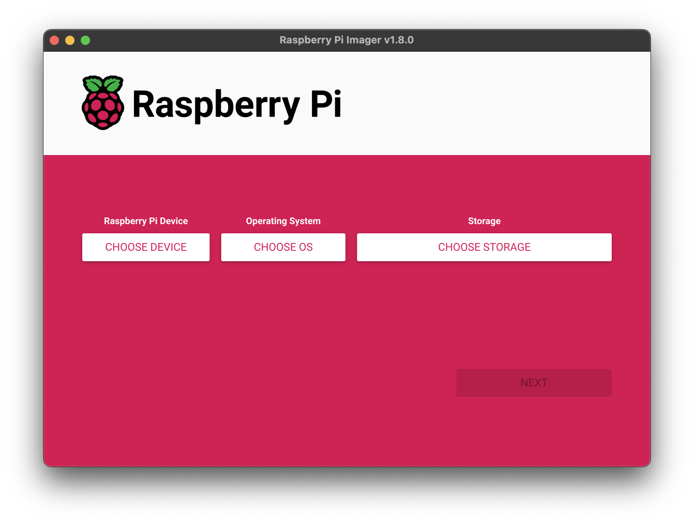
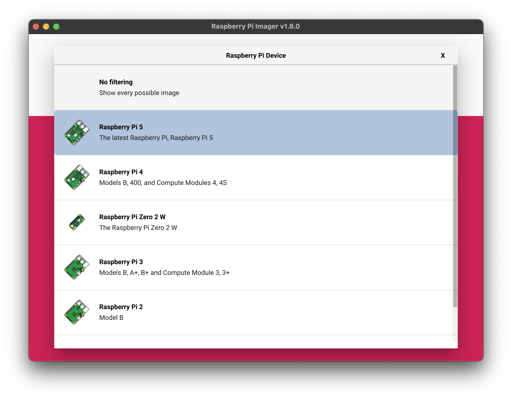
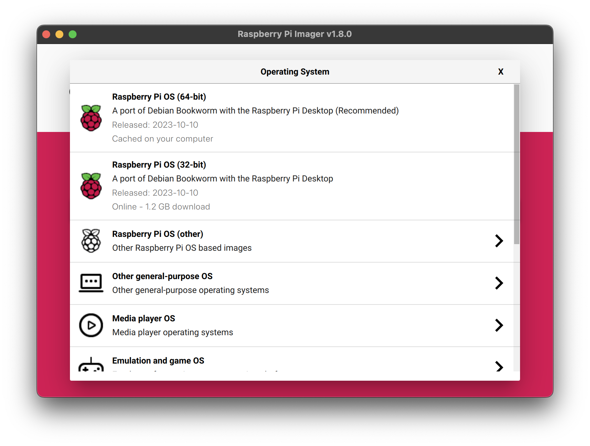
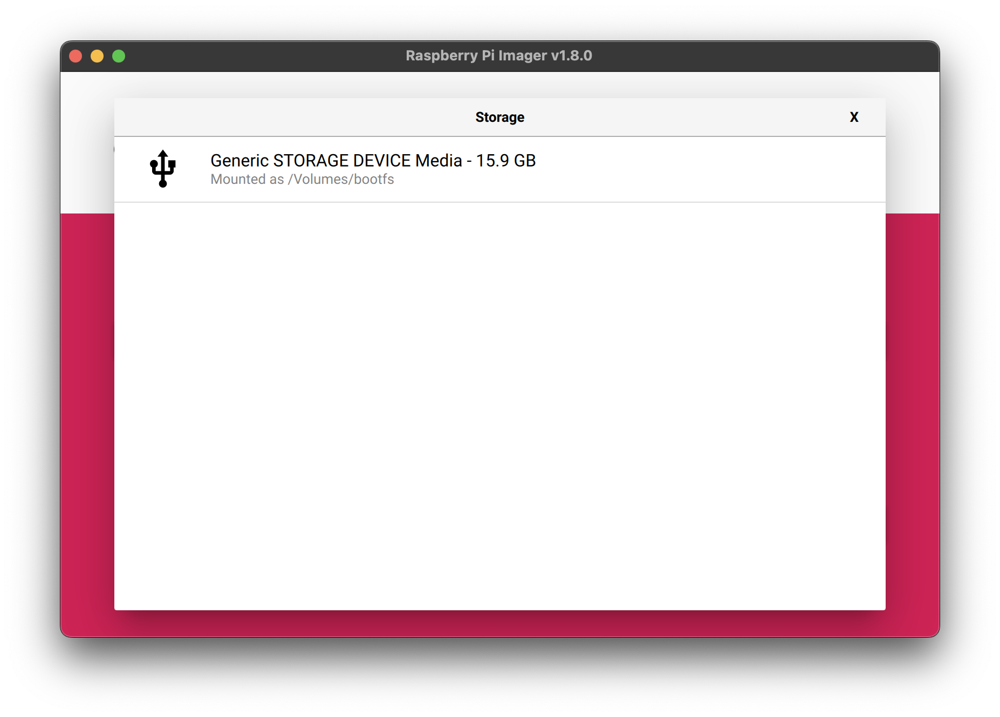
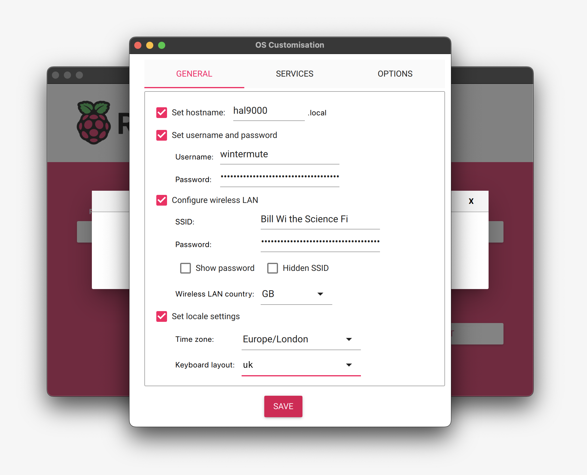
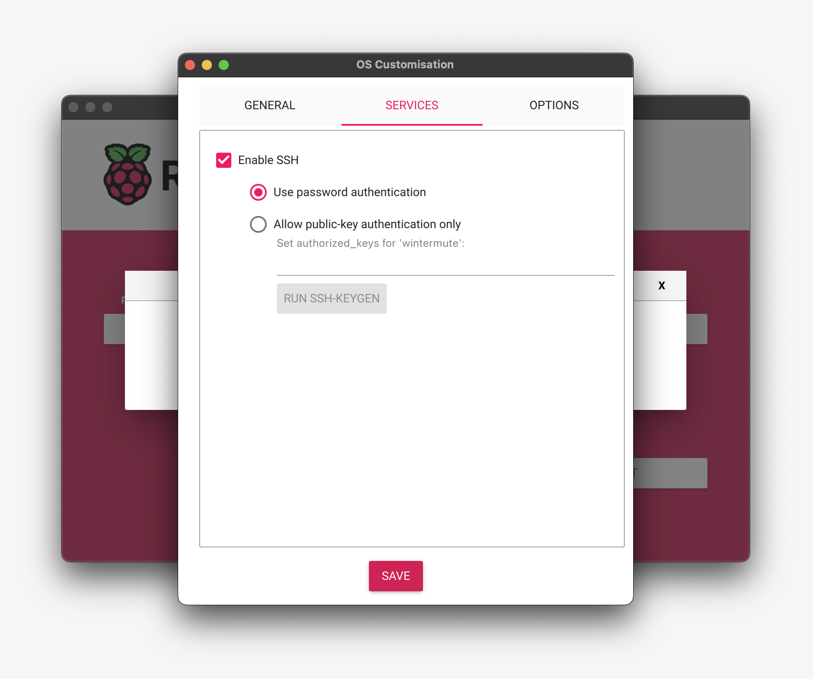
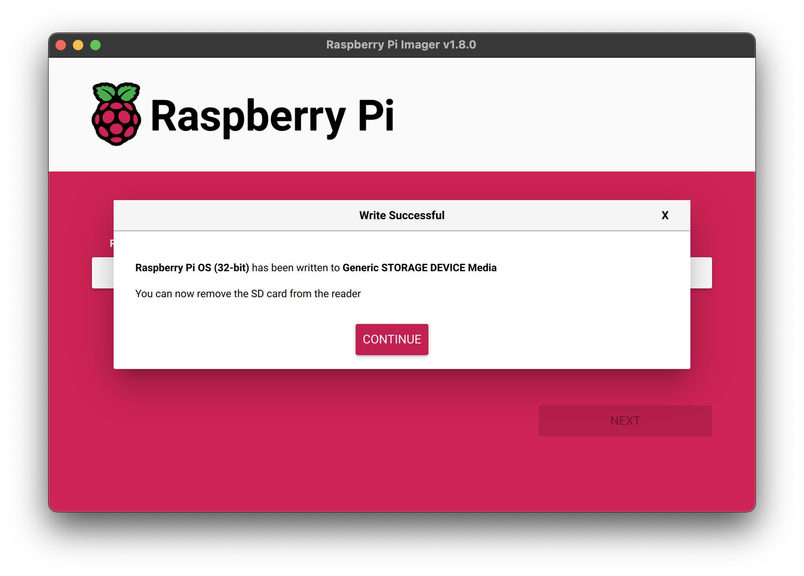
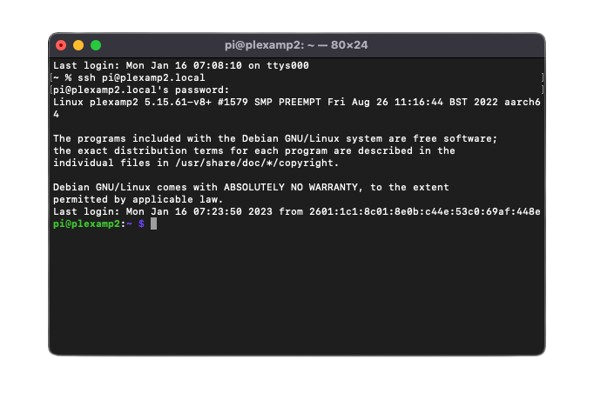

# Step-by-Step Guide to Setup Hardware

## Section 1: Raspberry Pi Initialization

  ### Requirements:
  1. Raspberry Pi  
  2. SD Card  
  3. Type-C Cable / Type-C Charger  
  4. Ethernet Cable (optional)  

### Raspberry Pi Setup Methods:
#### Method 1. Wired Setup:
  - Requires a micro HDMI cable to get the display directly from the board via the micro HDMI port.

#### Method 2. Headless Setup:
- Use SSH to access the Raspberry Pi board and configure it to install Remote Desktop Service (RDP).  
- Access the Raspberry Pi's visual interface via remote desktop software such as:
  - **Windows Remote Desktop Connection**
  - **RealVNC** (via IP address).

---
#### Warning:
- Avoid flashing the SD card multiple times or interrupting the flashing process. This could corrupt or permanently damage the card.  
- Ensure strong connections during setup and carefully follow all steps to minimize errors.

**For this project we configured Raspberry pi as Headless Installation.**

### Method 2. Headless Setup:
### Installing Raspberry Pi OS:
#### Step 1. Download the **Raspberry Pi Imager Tool** from the official website:  
- **For Windows**:  
  [Raspberry Pi OS using Raspberry Pi Imager](https://www.raspberrypi.com/software/)  
- **For Linux**:  
  Open a terminal window and type:  
```bash
sudo apt install rpi-imager
```
#### Step 2. Once you’ve installed Imager, launch the application by clicking the Raspberry Pi Imager icon or running `rpi-imager`.
  <p align="center">
  
  </p>

#### Step 3. Click Choose device and select your Raspberry Pi model from the list.
  <p align="center">
  
  </p>

#### Step 4. Then, Click **Choose OS** and select an operating system to install. 
- The Imager always shows the recommended version of Raspberry Pi OS for your model at the top of the list.
  <p align="center">
  
  </p>

#### For this project, we installed the latest **Raspberry Pi 64-bit Legacy Full**.
- **Alternative**: Raspberry Pi 64-bit Full.  
- **Why Legacy Full?**  
  - Easier and faster access to the Pi Camera Module. The Pi camera feed can be directly accessed by the OpenCV module, whereas other OS versions require manual installation of the `picamera2` library.
  - Faster boot times compared to Raspberry Pi 64-bit Full.
  - Slight performance and FPS improvement with lower CPU usage while using OpenCV video capture.

#### Step 5. Connect your preferred storage device (e.g., microSD card) to your computer using an external or built-in SD card reader. Then click **Choose Storage** and select your storage device.
  <p align="center">
  
  </p>

#### Warning:
- If you have more than one storage device connected to your computer, ensure you select the correct one! Identify storage devices by size. If unsure, disconnect other devices until you’re certain.

#### Step 6. Then, click Next. Imager will prompt you to apply OS customization. 
- It’s strongly recommended to configure your Raspberry Pi through the OS customization settings. Click **Edit Settings** to open the customization menu.  
- If skipped, the configuration wizard will prompt you during the first boot.
  <p align="center">
  
  </p>

#### OS Customization Options:
- Preconfigure:
  - A username and password.
  - Wi-Fi credentials.
  - Device hostname.
  - Time zone and keyboard layout.
  - Remote connectivity (e.g., enable SSH).

  <p align="center">
  
  </p>

- If prompted, allow Imager to prefill Wi-Fi credentials from your current network or enter them manually.  
  - **Hostname**: Define a unique hostname to avoid conflicts on networks with multiple Raspberry Pi devices. This will later then be used to identify the IP of your Raspberry Pi and also connect to it.
  - Go to the Services tab then:

  <p align="center">
  
  </p>

    - **Enable SSH**: Must be enabled for headless setup. Use password authentication to prevent unauthorized access.
  ### NOTE : SSH option must be enabled for the headless setup.

#### Step 7. After completing the customization, click **Save**, then **Yes** to apply the settings.
  <p align="center">
  
  </p>

#### Step 8. Click **Write** to begin writing the image to the storage device. Confirm any permissions or admin prompts. The process may take a few minutes. Then, You will see he following prompt in he imager:
  <p align="center">
  
  </p>

#### Step 9. Once completed, insert the SD card into your Raspberry Pi, connect the power cable, and wait a few seconds.

### Congratulations:
You’ve successfully configured your Raspberry Pi! 🎉  
For headless setups, ensure SSH is enabled and test network connectivity.

  ---

### Boot and Verification:
- Verify the Raspberry Pi has booted properly by observing the LED indicators:  
  - **PWR (red)**: Indicates power is supplied. On later models, it flashes if the voltage drops below 4.63V.  
  - **ACT (green)**: Indicates SD card activity:
  - Flashes during read/write operations.  
    - Flashing patterns indicate errors during boot:
      - 1 flash: Incompatible SD Card.
      - 2 flashes: SD Card cannot be read.
      - 3 flashes: `loader.bin` not found.
      - 4 flashes: `loader.bin` not launched.
      - 5 flashes: `start.elf` not found.
      - 6 flashes: `start.elf` not launched.
      - 7 flashes: `kernel.img` not found.

### Troubleshooting:
- If boot errors persist, repeat the setup process. Verify that:
  - The SD card is functioning correctly.
  - All steps are followed accurately.

  ---

## Section 2: Access the Raspberry pi using SSH (Only for Headless Setup)

#### Step 1: After the Raspberry pi boots up first of all you'll need to find the IP of the raspberry pi. In order to do that you'll need to install the following softwares based on your device: 
- **For Windows**:
  - [Advanced IP Scanner](https://www.advanced-ip-scanner.com/)
    - We found Advanced IP Scanner to be much more convinient and easy to use and quite faster than other tools.
    - Configure the IP address range in the adress bar to : `192.168.1.1-254`, `192.168.192.1-254`<br>
    - Here in our router configuration our given address was in the range from `192.168.1.1` to `192.168.192.254` so we set the range as above.<br>
    - Note that the router address range might differ for other config so check this setting might cover all the possible range.
  - [Angry IP Scanner for windows](https://angryip.org/download/#windows)
- **For Linux**:  
  - [Angry IP Scanner for Linux](https://angryip.org/download/#linux)    
- **For Android**
  - [Network Scanner](https://play.google.com/store/apps/details?id=com.myprog.netscan&hl=en)
  - For android, this tool was faster, easier and convinient.

#### Step 2: After the scan you'll see the Raspberry Pi IP with the hostname you setup in the settings during the boot.
- If you donot see the IP:
  - Make sure that the Wifi Ssid and Password you configured was correct if not you also manually setup hotspot of that same configured ssid and password using other device.
  - If the problem still exists try connecting ethernet and scan the ip again.
  - If you cannot still see the IP you'll need to restart the steps from the [Initialization-Section] of this guide and make sure you enable ssh option, and set the ssid and password as per your wifi/hotspot.

  ---

## Section 3: **Connect to Raspberry Pi via SSH**

### Method 1: Connect Directly via CMD**
  
#### Step 1: **Open CMD**:  
- Press `Win+R`.  
- Type `CMD` and press **Enter**.

#### Step 2: **Connect Using SSH**:  
- Type the following command in the terminal:  
```bash
ssh [username]@[ip-address]
```
- Here replace:  
  - `[username]` with your Raspberry Pi's username (e.g., `pi`).  
  - `[ip-address]` with the IP address or domain name of your Raspberry Pi.

#### Step 3: **If the SSH Port is Different from the Default (22)**:  
- Use the `-p` option to specify the port number:  
```bash
ssh [username]@[ip-address] -p [port-number]
```
  Replace `[port-number]` with the port used by your Raspberry Pi's SSH server.

#### Step 4: **Host Key Verification**:  
- When connecting for the first time, you’ll see a prompt like this:  
```bash
The authenticity of host '[example.com] (93.184.216.34)' can't be established.
ECDSA key fingerprint is SHA256:d029f87e3d80f8fd9b1be67c7426b4cc1ff47b4a9d0a84.
Are you sure you want to continue connecting (yes/no)?
```
  - Type `yes` to proceed.  
  - This step adds the Raspberry Pi’s SSH key to your known hosts file for future connections.  

#### Step 5: **Enter Password**:  
- When prompted, type the password you set up during the Raspberry Pi Imager installation process.  
- Once authenticated, you will enter the Raspberry Pi terminal.

<p align="center">

</p>

  ---
    
### Section 4: **Enable VNC, Serial Port, and GPIO**
- After logging in via SSH, follow these steps:

#### Step 1: **Open Raspberry Pi Configuration**:  
Run the following command:  
```bash
sudo raspi-config
```
  <p align="center">
  
  </p>

#### Step :. **Access Interface Options**:  
- You will see a BIOS-like configuration interface.  
- Use the arrow keys to navigate.  
- Highlight **Interface Options** and press **Enter**.

#### Step 3: **Enable VNC Server**:  
- Navigate to **VNC** and press **Enter**.  
- When prompted with `Would you like to enable VNC Server?`, select **Yes** and press **Enter**.

#### Step 4: **Enable Serial Port**:  
- Go back to **Interface Options**.  
- Highlight **Serial Port** and press **Enter**.  
- Follow the prompts to enable the serial port.

#### Step5: **Enable Remote GPIO**:  
- Go back to **Interface Options**.  
- Highlight **Remote GPIO** and press **Enter**.  
- Follow the prompts to enable it.

#### Step 6: **Finish and Reboot**:  
- After enabling the required options, navigate to **Finish** and press **Enter**.  
- Reboot the Raspberry Pi if prompted.

  ---

### ⚠️ **Note**:
- If you encounter any issues during SSH connection, ensure SSH is enabled on the Raspberry Pi.  
      You can enable it in `sudo raspi-config` under **Interface Options** > **SSH**.  
- For VNC, ensure you have a VNC client installed on your computer to connect after enabling it.

  --- 

### Section 5 : **Connect to Raspberry Pi and View Desktop on Windows**
- After enabling VNC on your Raspberry Pi, you can view its desktop remotely on a Windows machine using one of the following methods:

#### Note: **Before proceeding ensure the VNC Server is Running**:  
- To ensure the VNC server is active, run the following commands on the Raspberry Pi via ssh terminal:  
```bash
sudo systemctl start vncserver-x11-serviced   # Starts VNC Server immediately
sudo systemctl enable vncserver-x11-serviced # Enables VNC Server to start on boot
```
  ----

### **Which Method Should You Use?**
#### Method 1: **Windows Remote Desktop**:  
- Recommended for users who want smoother performance and better clipboard and file-sharing capabilities.  

#### Method 2: **VNC Viewer**:  
- Offers more flexibility and works across multiple platforms (Windows, macOS, Linux, and mobile devices).  
- If you encounter clipboard or file transfer issues with a VNC viewer, switching to Windows Remote Desktop is recommended.

  ---

### **Method 1: Connect via Windows Remote Desktop**

#### Step 1: **Open Remote Desktop on Windows**:  
  - In the Windows search bar, type **Remote Desktop Connection** and press **Enter** to open the application.

#### Step 2: **Enter Raspberry Pi Details**:  
  - In the **Computer** field, enter:  
    - The IP address of the Raspberry Pi (e.g., `192.168.x.x`)  
    - Or `raspberrypi.local` if both devices are on the same network.  
  - Click **Show Options**, and enter the Raspberry Pi's **username** and **password** under the **User name** and **Password** fields.  
  - Save the credentials to avoid re-entering them for future logins.

#### Step 3: **Log In**:  
  - Click **Connect**. You may encounter a warning about the certificate; click **Yes** to proceed.  
  - Enter your credentials again if prompted, and you’ll be logged into the Raspberry Pi desktop.

  <p align="center">
  
  </p>

   ---

### **Method 2: Connect via VNC Viewer**

#### Step 1: **Download and Install a VNC Viewer**:  
- Choose one of the following VNC viewers:  
  - **RealVNC**: [Download here](https://www.realvnc.com/en/connect/download/viewer/).  
  - **TigerVNC**: [Download here](https://tigervnc.org/).  

  - For mobile devices, you can also download [RealVNC](https://www.realvnc.com/en/connect/download/viewer/android/)  for Android or iOS.

  From the above one RealVNC is suggested due to its easy with convinient UI and functionality.

#### Step 2. **Launch the VNC Viewer**:  
- Open the installed VNC viewer application.  

#### Step 3. **Enter Raspberry Pi Details**:  
- In the VNC viewer's address bar, enter:  
  - The Raspberry Pi’s IP address (e.g., `192.168.x.x`).  
  - Or `raspberrypi.local` if both devices are on the same network.

#### Step 4. **Authenticate**:  
- When prompted, enter the **username** and **password** of the Raspberry Pi. 

#### Step 5. **View the Desktop**:  
- Once authenticated, the Raspberry Pi desktop will appear on your Windows machine.

  <p align="center">
  
  </p>

   ---

## ¡Felicitaciones! You’ve successfully setup your Headless Raspberry Pi! 🎉
  With either of these above methods, you can wirelessly access and control your Raspberry Pi desktop from your Windows machine. Once configured, proceed to the [**Raspberry Pi Peripherals**](Peripherals-config.md) section to continue.