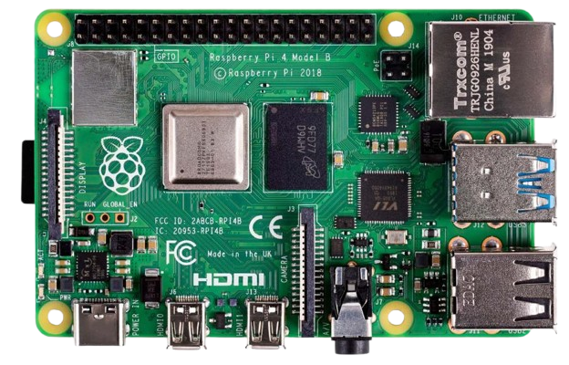
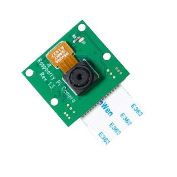
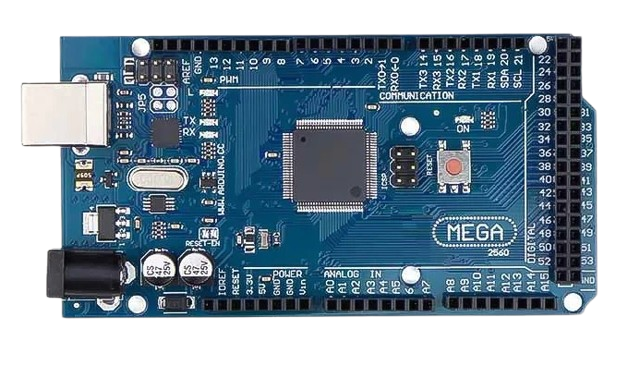

## Hardware Used 

### **Raspberry Pi Model 4B**

### **Pi Camera Module v1.3**

### **Arduino Mega**

### **MG996r Servo Motor**

### **3D Printed Parts (using PLA Filament)**
[//]: <> (
No image available
)

Checkout Step by step guide [here](Raspberry-pi-config.md) to setup the Raspberry-pi.
