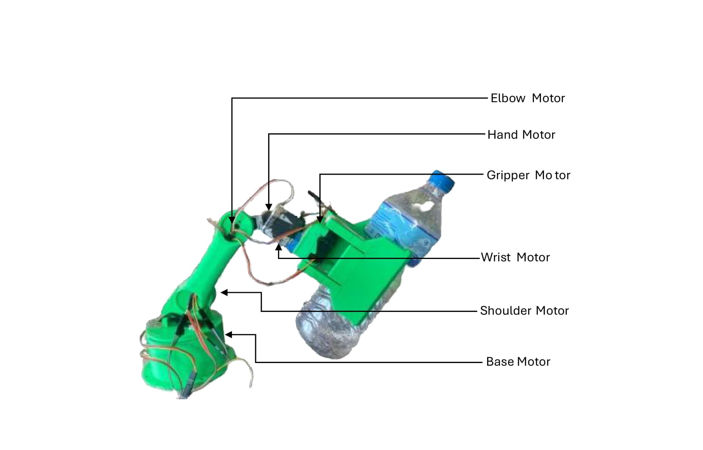

# ARM Logic Development

This section outlines the development process for implementing arm logic. In this project, we opted for a **linear method**, which is simpler and suitable for testing functionality. In future iterations, we plan to implement **inverse kinematics** for more precise movements.

If your model is fully prepared, you may proceed directly to implementing the inverse kinematics method. Otherwise, the linear method serves as an excellent foundation for prototyping and testing.

The Servo position in our setup is as:
**Base Motor        : 0 moves the arm to the left, 180 moves the arm to the right**
**Shoulder Motor    : 0 moves the arm lower, 60 raises the arm**
**Elbow Motor       : 180 lowers the arm, 90 raises the arm**
**Wrist Motor       : 0 rotates the gripper horizontally, 90 rotates to the vertical position**
**Gripper Motor     : 40 opens the gripper, 180 grabs/closes the gripper**

### **Servo Motor Configuration**
<p align="center">

</p>

---

## **What is the Linear Method?**
The linear method maps the detected object's position in the camera frame to corresponding servo angles through interpolation. This approach ensures straightforward arm movement based on object detection.

---

## **Step-by-Step Guide**

### **Step 1: Test Your Camera Feed**
- Run the following script to verify that the camera is functioning correctly:

```python
import cv2

# Initialize camera
cap = cv2.VideoCapture(0)

while True:
    ret, frame = cap.read()
    cv2.imshow('Video Stream', frame)

    # Exit loop when 'q' is pressed
    if cv2.waitKey(1) & 0xFF == ord('q'):
        break

cap.release()
cv2.destroyAllWindows()
```
- This script captures video frames and displays them in a window. Press 'q' to quit.

---

### **Step 2: Detect Colored Objects**
- To detect colored objects and draw bounding boxes around them, use this script:

```python
import cv2
import numpy as np

# Initialize the camera
cap = cv2.VideoCapture(0)

while True:
    # Capture frame-by-frame
    ret, frame = cap.read()
    
    # Convert the frame from BGR to HSV color space
    hsv = cv2.cvtColor(frame, cv2.COLOR_BGR2HSV)

    # Define the color range for detection (adjust as needed)
    lower_color = np.array([30, 50, 50])
    upper_color = np.array([90, 255, 255])

    # Create a mask that captures areas of the frame within the color range
    mask = cv2.inRange(hsv, lower_color, upper_color)
    
    # Find contours in the mask
    contours, _ = cv2.findContours(mask, cv2.RETR_EXTERNAL, cv2.CHAIN_APPROX_SIMPLE)

    # Iterate over each contour found
    for contour in contours:
        # Get the bounding box coordinates for the contour
        x, y, w, h = cv2.boundingRect(contour)
        
        # Draw a rectangle around the detected object
        cv2.rectangle(frame, (x, y), (x + w, y + h), (0, 255, 0), 2)

    # Display the resulting frame with detected objects
    cv2.imshow('Object Detection', frame)
    
    # Break the loop when 'q' key is pressed
    if cv2.waitKey(1) & 0xFF == ord('q'):
        break

# Release the camera and close all OpenCV windows
cap.release()
cv2.destroyAllWindows()
```

- This code adds object detection functionality by thresholding the grayscale image to detect white objects and then finding contours around them.
- You can change the threshold to configure for various colored objects.
#### Note: The color detection heavily depends on the lighting and surrounding environment.

---

### **Step 3: Fetch Object Centroid**
- Extract the centroid of the detected object for mapping arm movements:

```python
import cv2
import numpy as np

# Initialize the camera
cap = cv2.VideoCapture(0)

while True:
    # Capture frame-by-frame
    ret, frame = cap.read()
    
    # Convert the frame from BGR to HSV color space
    hsv = cv2.cvtColor(frame, cv2.COLOR_BGR2HSV)

    # Define the color range for detection (adjust as needed)
    lower_color = np.array([30, 50, 50])
    upper_color = np.array([90, 255, 255])

    # Create a mask that captures areas of the frame within the color range
    mask = cv2.inRange(hsv, lower_color, upper_color)
    
    # Find contours in the mask
    contours, _ = cv2.findContours(mask, cv2.RETR_EXTERNAL, cv2.CHAIN_APPROX_SIMPLE)

    if contours:
        # Get the largest contour
        largest_contour = max(contours, key=cv2.contourArea)
        
        # Get the bounding box coordinates for the largest contour
        x, y, w, h = cv2.boundingRect(largest_contour)
        
        # Calculate the centroid coordinates
        centroid_x = x + w // 2
        centroid_y = y + h // 2
        
        # Draw a circle at the centroid
        cv2.circle(frame, (centroid_x, centroid_y), 5, (255, 0, 0), -1)

    # Display the resulting frame with the centroid
    cv2.imshow('Centroid Detection', frame)
    
    # Break the loop when 'q' key is pressed
    if cv2.waitKey(1) & 0xFF == ord('q'):
        break

# Release the camera and close all OpenCV windows
cap.release()
cv2.destroyAllWindows()
```
- This script captures video frames, detects objects of a specified color, and calculates the centroid of the largest detected object. The centroid is marked with a blue circle.

---

#### Before proceeding, verify the Arduino port as shown in the `peripherals-config.md` file and test the serial communication.

### **Step 4: Base Servo Motion Test**
- Fit the base servo such that a 0-degree angle moves the arm to the far left and 180 degrees moves it to the far right.
- Use the centroid data to interpolate servo angles linearly based on the object's position in the frame.

```python
import cv2
import numpy as np
import serial

# Initialize serial communication with Arduino
ser = serial.Serial('/dev/ttyACM0', 9600, timeout=1)

# Initialize the camera
cap = cv2.VideoCapture(0)

while True:
    # Capture frame-by-frame
    ret, frame = cap.read()
    
    # Convert the frame from BGR to HSV color space
    hsv = cv2.cvtColor(frame, cv2.COLOR_BGR2HSV)

    # Define the color range for detection (adjust as needed)
    lower_color = np.array([30, 50, 50])
    upper_color = np.array([90, 255, 255])

    # Create a mask that captures areas of the frame within the color range
    mask = cv2.inRange(hsv, lower_color, upper_color)
    
    # Find contours in the mask
    contours, _ = cv2.findContours(mask, cv2.RETR_EXTERNAL, cv2.CHAIN_APPROX_SIMPLE)

    if contours:
        # Get the largest contour
        largest_contour = max(contours, key=cv2.contourArea)
        
        # Get the bounding box coordinates for the largest contour
        x, y, w, h = cv2.boundingRect(largest_contour)
        
        # Calculate the centroid coordinates
        centroid_x = x + w // 2
        centroid_y = y + h // 2
        
        # Draw a circle at the centroid
        cv2.circle(frame, (centroid_x, centroid_y), 5, (255, 0, 0), -1)

        # Interpolate the centroid position to servo angle
        base_angle = np.interp(centroid_x, [0, frame.shape[1]], [0, 180])
        
        # Send the angle to the Arduino
        ser.write(f"{int(base_angle)}\n".encode('utf-8'))

    # Display the resulting frame with the centroid
    cv2.imshow('Base Servo Test', frame)
    
    # Break the loop when 'q' key is pressed
    if cv2.waitKey(1) & 0xFF == ord('q'):
        break

# Release the camera and close all OpenCV windows
cap.release()
cv2.destroyAllWindows()
```

- Based on this logic, if the object is on the left side of the frame, the base motor moves the arm to the left (0 degrees in our setup). If the object is on the right side of the frame, the base motor moves the arm to the right (180 degrees).


**Arduino Code for Base Servo Motion:**

```c
#include <Servo.h>

Servo baseServo;

void setup() {
    baseServo.attach(2);  // Attach the base servo to pin 2
    Serial.begin(9600);
}

void loop() {
    if (Serial.available() > 0) {
        int angle = Serial.parseInt();
        angle = constrain(angle, 0, 180);  // Ensure angle is within range
        baseServo.write(angle);
    }
}
```

---

### **Step 5: Vertical Motion Test**
- Define ranges for the shoulder and elbow servos.
- Combine their motion to achieve vertical arm movement.
- Use interpolation to map the centroid’s vertical position to the servos' angles.

```python
import cv2
import numpy as np
import serial

# Initialize serial communication with Arduino
ser = serial.Serial('/dev/ttyACM0', 9600, timeout=1)

# Initialize the camera
cap = cv2.VideoCapture(0)

while True:
    # Capture frame-by-frame
    ret, frame = cap.read()
    
    # Convert the frame from BGR to HSV color space
    hsv = cv2.cvtColor(frame, cv2.COLOR_BGR2HSV)

    # Define the color range for detection (adjust as needed)
    lower_color = np.array([30, 50, 50])
    upper_color = np.array([90, 255, 255])

    # Create a mask that captures areas of the frame within the color range
    mask = cv2.inRange(hsv, lower_color, upper_color)
    
    # Find contours in the mask
    contours, _ = cv2.findContours(mask, cv2.RETR_EXTERNAL, cv2.CHAIN_APPROX_SIMPLE)

    if contours:
        # Get the largest contour
        largest_contour = max(contours, key=cv2.contourArea)
        
        # Get the bounding box coordinates for the largest contour
        x, y, w, h = cv2.boundingRect(largest_contour)
        
        # Calculate the centroid coordinates
        centroid_x = x + w // 2
        centroid_y = y + h // 2
        
        # Draw a circle at the centroid
        cv2.circle(frame, (centroid_x, centroid_y), 5, (255, 0, 0), -1)

        # Interpolate the centroid position to servo angles
        shoulder_angle = np.interp(centroid_y, [0, frame.shape[0]], [0, 60])
        elbow_angle = np.interp(centroid_y, [0, frame.shape[0]], [30, 120])
        
        # Send the angles to the Arduino
        ser.write(f"{int(shoulder_angle)},{int(elbow_angle)}\n".encode('utf-8'))

    # Display the resulting frame with the centroid
    cv2.imshow('Vertical Motion Test', frame)
    
    # Break the loop when 'q' key is pressed
    if cv2.waitKey(1) & 0xFF == ord('q'):
        break

# Release the camera and close all OpenCV windows
cap.release()
cv2.destroyAllWindows()
```

**Arduino Code for Vertical Motion:**

```c
#include <Servo.h>

Servo shoulderServo;
Servo elbowServo;

void setup() {

    void setup() {
        shoulderServo.attach(3);  // Attach the shoulder servo to pin 3
        elbowServo.attach(4);     // Attach the elbow servo to pin 4
        Serial.begin(9600);       // Initialize serial communication at 9600 baud
    }

    void loop() {
        if (Serial.available() > 0) {  // Check if there is any data available to read
            String data = Serial.readStringUntil('\n');  // Read the incoming data as a string until newline character
            int shoulderAngle = data.substring(0, data.indexOf(',')).toInt();  // Extract and convert the shoulder angle
            int elbowAngle = data.substring(data.indexOf(',') + 1).toInt();    // Extract and convert the elbow angle

            shoulderServo.write(constrain(shoulderAngle, 0, 60));  // Write the constrained shoulder angle to the servo
            elbowServo.write(constrain(elbowAngle, 30, 120));      // Write the constrained elbow angle to the servo
        }
    }
    shoulderServo.attach(3);  // Attach the shoulder servo to pin 3
    elbowServo.attach(4);     // Attach the elbow servo to pin 4
    Serial.begin(9600);
}
```

---

### **Step 6: Hand Motion Test**
- For the hand angle, the hand lowers to grab the object and lifts it upwards once grabbed. However, due to a servo motor malfunction, we fixed the hand angle motor so that it is always in the lower position.

- If your data is annotated such that only the object is selected, you can apply the following logic:
    - Find the tilt angle compared to the camera's horizontal axis, then match the wrist servo angle accordingly.

**Arduino Code for Hand Motion:**
- Test your hand motor:
```c
#include <Servo.h>

Servo handServo;

void setup() {
  handServo.attach(5);  // Attach the hand servo to pin 5
  Serial.begin(9600);
}

void loop() {
  if (Serial.available() > 0) {
    int handAngle = Serial.parseInt();
    handServo.write(constrain(handAngle, 0, 90));
  }
}
```

---

### **Step 7: Wrist Angle Test**

- To determine the orientation of the object, we need to find its width and length. Our arm design is like a claw that opens and grabs the object based on its orientation.
- In our case, the data annotated was in the form of a rectangle that overlaps the object. We used the following logic:
    - Grabbing the object by its width.
    - Since water bottles have a smaller width and longer length, we first get the orientation by checking if the length (`l`) is greater than the breadth (`b`) or vice versa.
    - We then rotate the wrist so that the orientation matches the width.

**Test Code for Wrist Angle:**

```python
import cv2
import numpy as np
import serial

# Initialize serial communication with Arduino
ser = serial.Serial('/dev/ttyACM0', 9600, timeout=1)

# Initialize the camera
cap = cv2.VideoCapture(0)

while True:
        # Capture frame-by-frame
        ret, frame = cap.read()
        
        # Convert the frame from BGR to HSV color space
        hsv = cv2.cvtColor(frame, cv2.COLOR_BGR2HSV)

        # Define the color range for detection (adjust as needed)
        lower_color = np.array([30, 50, 50])
        upper_color = np.array([90, 255, 255])

        # Create a mask that captures areas of the frame within the color range
        mask = cv2.inRange(hsv, lower_color, upper_color)
        
        # Find contours in the mask
        contours, _ = cv2.findContours(mask, cv2.RETR_EXTERNAL, cv2.CHAIN_APPROX_SIMPLE)

        if contours:
                # Get the largest contour
                largest_contour = max(contours, key=cv2.contourArea)
                
                # Get the bounding box coordinates for the largest contour
                x, y, w, h = cv2.boundingRect(largest_contour)
                
                # Calculate the centroid coordinates
                centroid_x = x + w // 2
                centroid_y = y + h // 2
                
                # Draw a circle at the centroid
                cv2.circle(frame, (centroid_x, centroid_y), 5, (255, 0, 0), -1)

                # Determine the orientation and set wrist angle
                if w > h:
                        wrist_angle = 90  # Horizontal orientation
                else:
                        wrist_angle = 0   # Vertical orientation
                
                # Send the wrist angle to the Arduino
                ser.write(f"{int(wrist_angle)}\n".encode('utf-8'))

        # Display the resulting frame with the centroid
        cv2.imshow('Wrist Angle Test', frame)
        
        # Break the loop when 'q' key is pressed
        if cv2.waitKey(1) & 0xFF == ord('q'):
                break

# Release the camera and close all OpenCV windows
cap.release()
cv2.destroyAllWindows()
```

**Arduino Code for Wrist Angle:**

```c
#include <Servo.h>

// Create a Servo object for the wrist
Servo wristServo;

void setup() {
    // Attach the wrist servo to pin 6
    wristServo.attach(6);
    // Initialize serial communication at 9600 baud
    Serial.begin(9600);
}

void loop() {
    // Check if there is any data available to read
    if (Serial.available() > 0) {
        // Read the incoming data as an integer
        int wristAngle = Serial.parseInt();
        // Write the constrained wrist angle to the servo
        wristServo.write(constrain(wristAngle, 0, 180));
    }
}
```

---

### **Step 8: Gripper Test**
- To test the gripper, we used a simple logic of fully opening the gripper before grabbing the object and then fully closing it when the arm reaches the final position.

```python
import serial
import time

# Initialize serial communication with Arduino
ser = serial.Serial('/dev/ttyACM0', 9600, timeout=1)

def test_gripper(angle):
    ser.write(f"{int(angle)}\n".encode('utf-8'))
    time.sleep(1)  # Wait for the servo to move

# Test the gripper by opening and closing it
try:
    while True:
        test_gripper(0)    # Open gripper
        time.sleep(2)
        test_gripper(120)  # Close gripper
        time.sleep(2)
except KeyboardInterrupt:
    ser.close()
```

**Arduino Code for Gripper:**
```c
#include <Servo.h>

Servo gripperServo;

void setup() {
    gripperServo.attach(7);  // Attach the gripper servo to pin 7
    Serial.begin(9600);      // Initialize serial communication at 9600 baud
}

void loop() {
    if (Serial.available() > 0) {  // Check if there is any data available to read
        int gripperAngle = Serial.parseInt();  // Read the incoming data as an integer
        gripperServo.write(constrain(gripperAngle, 0, 120));  // Write the constrained gripper angle to the servo
    }
}
```
- This code initializes the gripper servo and sets it to open or close based on the received angle.

- The customized version of this logic could be:
    - Get the width size of the object.
    - Linearly interpolate to match the width and the gripper angle to match the object.

---

### **Step 9: Combine Motion for Object Handling**

**Combined Code for Colored Object Detection and Grab:**

```python
import cv2
import numpy as np
import serial

# Initialize serial communication with Arduino
ser = serial.Serial('/dev/ttyACM0', 9600, timeout=1)

# Define servo limits
servo_limits = {
    'base': (0, 180),
    'shoulder': (0, 60),
    'elbow': (30, 120),
    'hand': (0, 90),
    'wrist': (0, 180),
    'gripper': (0, 120)
}

# Function to send angles to Arduino
def send_angles(angles):
    """
    Sends the servo angles to the Arduino via serial communication.

    Parameters:
    angles (dict): A dictionary containing the angles for each servo motor.
    """
    command = ",".join([str(int(angles[k])) for k in servo_limits.keys()]) + '\n'
    ser.write(command.encode('utf-8'))

# Function to move arm to drop position and return to initial position
def drop_object():
    drop_angles = {
        'base': 90,
        'shoulder': 30,
        'elbow': 60,
        'hand': 45,
        'wrist': 90,
        'gripper': 0  # Open gripper to drop object
    }
    send_angles(drop_angles)
    time.sleep(2)  # Wait for the arm to move and drop the object

    # Return to initial position
    initial_angles = {
        'base': 90,
        'shoulder': 0,
        'elbow': 90,
        'hand': 45,
        'wrist': 90,
        'gripper': 60  # Close gripper
    }
    send_angles(initial_angles)
    time.sleep(2)  # Wait for the arm to return to initial position

cap = cv2.VideoCapture(0)

while True:
    ret, frame = cap.read()
    hsv = cv2.cvtColor(frame, cv2.COLOR_BGR2HSV)

    # Define color range for object detection
    lower_color = np.array([30, 50, 50])
    upper_color = np.array([90, 255, 255])

    # Create a mask for the detected color
    mask = cv2.inRange(hsv, lower_color, upper_color)
    contours, _ = cv2.findContours(mask, cv2.RETR_EXTERNAL, cv2.CHAIN_APPROX_SIMPLE)

    if contours:
        # Find the largest contour
        largest_contour = max(contours, key=cv2.contourArea)
        x, y, w, h = cv2.boundingRect(largest_contour)
        centroid_x = x + w // 2
        centroid_y = y + h // 2

        # Interpolate angles based on the centroid position
        base_angle = np.interp(centroid_x, [0, frame.shape[1]], servo_limits['base'])
        shoulder_angle = np.interp(centroid_y, [0, frame.shape[0]], servo_limits['shoulder'])
        elbow_angle = 90
        hand_angle = 45
        wrist_angle = 90 if w > h else 0
        gripper_angle = 60

        # Send the calculated angles to the Arduino
        send_angles({
            'base': base_angle,
            'shoulder': shoulder_angle,
            'elbow': elbow_angle,
            'hand': hand_angle,
            'wrist': wrist_angle,
            'gripper': gripper_angle
        })

        # Simulate grabbing the object
        time.sleep(2)  # Wait for the arm to grab the object
        drop_object()  # Move to drop position and return to initial position

    # Display the frame with object detection
    cv2.imshow('Object Detection', frame)
    if cv2.waitKey(1) & 0xFF == ord('q'):
        break

# Release the video capture and close all OpenCV windows
cap.release()
cv2.destroyAllWindows()

```

**Arduino Code for Colored Object Detection and Grab :**
```c
/**
 * Initializes the serial communication and attaches the servos to their respective pins.
 * This function is called once when the sketch starts.
 */
void setup() {
    // Initialize serial communication at 9600 baud
    Serial.begin(9600);

    // Attach servos to their respective pins
    baseServo.attach(2);
    shoulderServo.attach(3);
    elbowServo.attach(4);
    handServo.attach(5);
    wristServo.attach(6);
    gripperServo.attach(7);
}

/**
 * Reads the serial input, parses the angles, and moves the servos accordingly.
 * This function is called repeatedly in the main loop.
 */
void loop() {
    // Check if data is available on the serial port
    if (Serial.available() > 0) {
        // Read the incoming string
        String input = Serial.readStringUntil('\n');

        // Parse the angles from the input string
        int angles[6];
        parseAngles(input, angles);

        // Move the servos to the specified angles
        moveServos(angles);
    }
}

/**
 * Parses a comma-separated string of angles and stores them in the provided array.
 * 
 * @param input The input string containing the angles.
 * @param angles The array to store the parsed angles.
 */
void parseAngles(String input, int angles[]) {
    // Split the input string by commas and convert to integers
    int index = 0;
    int start = 0;
    int end = input.indexOf(',');

    while (end != -1) {
        angles[index++] = input.substring(start, end).toInt();
        start = end + 1;
        end = input.indexOf(',', start);
    }

    // Add the last angle
    angles[index] = input.substring(start).toInt();
}

/**
 * Moves the servos to the specified angles, ensuring the angles are within the allowed ranges.
 * 
 * @param angles The array containing the angles for each servo.
 */
void moveServos(int angles[]) {
    // Constrain and move each servo to the specified angle
    baseServo.write(constrain(angles[0], 0, 180));
    shoulderServo.write(constrain(angles[1], 0, 60));
    elbowServo.write(constrain(angles[2], 30, 120));
    handServo.write(constrain(angles[3], 0, 90));
    wristServo.write(constrain(angles[4], 0, 180));
    gripperServo.write(constrain(angles[5], 0, 120));
}
```

---

### **Final Code with Model-Based Detection**

```python
import cv2
import time
import numpy as np
import serial
import mediapipe as mp
from mediapipe.tasks import python
from mediapipe.tasks.python import vision

# Initialize serial communication with Arduino Mega
arduino = serial.Serial('/dev/ttyACM0', 9600, timeout=1)
time.sleep(2)  # Wait for the connection to be established

def send_angles_to_arduino(base_angle, shoulder_angle, elbow_angle ,hand_angle, wrist_angle, gripper_angle):
    """Sends the calculated servo angles to the Arduino."""
    command = f"{int(base_angle)},{int(shoulder_angle)},{int(elbow_angle)},{int(hand_angle)},{int(wrist_angle)},{int(gripper_angle)}\n"
    arduino.write(command.encode())


# Define initial servo angles
initial_base_angle = 180
initial_shoulder_angle = 60
initial_elbow_angle = 120
initial_hand_angle =45
initial_wrist_angle = 0
initial_gripper_angle = 120

# Send initial angles to Arduino
send_angles_to_arduino(initial_base_angle, initial_shoulder_angle, initial_elbow_angle,initial_hand_angle, initial_wrist_angle, initial_gripper_angle)
time.sleep(2)  # Allow servos to reach initial position

# Define the frame size
FRAME_WIDTH = 640
FRAME_HEIGHT = 480

# Servo limits
servo_limits = {
    'base': (0, 180),
    'shoulder': (0, 60),
    'elbow': (180, 90),
    'wrist': (0, 90),
    'gripper': (40, 180)
}

# Model loading and configuration
model_path = r'enter_path'
base_options = python.BaseOptions(model_asset_path=model_path)
options = vision.ObjectDetectorOptions(base_options=base_options,
                                       score_threshold=0.7,
                                       max_results=4)
detector = vision.ObjectDetector.create_from_options(options)

# Initialize the webcam using OpenCV
cap = cv2.VideoCapture(0)
cap.set(cv2.CAP_PROP_FRAME_WIDTH, FRAME_WIDTH)
cap.set(cv2.CAP_PROP_FRAME_HEIGHT, FRAME_HEIGHT)

def visualize(image, detection_result):
    """Draws bounding boxes and labels on the input image."""

    for detection in detection_result.detections:
        # Get the bounding box coordinates
        bbox = detection.bounding_box
        start_point = (int(bbox.origin_x), int(bbox.origin_y))
        end_point = (int(bbox.origin_x + bbox.width), int(bbox.origin_y + bbox.height))
        
        # Draw a rectangle around the detected object
        cv2.rectangle(image, start_point, end_point, (0, 255, 0), 2)

        # Optional: Add text for labels and scores

        # Get the category of the detected object
        category = detection.categories[0]
        # Get the category name
        category_name = category.category_name
        # Get the probability score and round it to 2 decimal places
        probability = round(category.score, 2)
        # Create the result text to display
        result_text = f"{category_name} ({probability})"
        # Put the result text on the image
        cv2.putText(image, result_text, (start_point[0], start_point[1] - 10), cv2.FONT_HERSHEY_SIMPLEX, 0.5, (0, 255, 0), 2)

    return image

def track_objects(frame):
    """Tracks the object detected by the MediaPipe model."""
    # Convert to RGB for the MediaPipe model
    rgb_image = cv2.cvtColor(frame, cv2.COLOR_BGR2RGB)
    mp_image = mp.Image(image_format=mp.ImageFormat.SRGB, data=rgb_image)

    # Run object detection
    detection_result = detector.detect(mp_image)

    # Visualize the detection on the frame
    frame = visualize(frame, detection_result)

    if detection_result.detections:
        # Get the first detection (assuming single object tracking)
        detection = detection_result.detections[0]
        bbox = detection.bounding_box

        # Calculate centroid of the bounding box
        centroid_x = int(bbox.origin_x + bbox.width / 2)
        centroid_y = int(bbox.origin_y + bbox.height / 2)

        # Calculate servo angles based on centroid position
        base_angle = 90 - (centroid_x - FRAME_WIDTH // 2) * 0.2  # Adjust the multiplier as needed
        base_angle = np.clip(base_angle, servo_limits['base'][0], servo_limits['base'][1])

        # Linear mapping of y-coordinate to shoulder and elbow angles
        shoulder_angle = np.interp(centroid_y, [FRAME_HEIGHT, 0], [0, 60])
        elbow_angle = np.interp(centroid_y, [FRAME_HEIGHT, 0], [180, 90])

        # Calculate wrist angle based on the aspect ratio of the bounding box
        wrist_angle = 90 if bbox.height > bbox.width else 0
        wrist_angle = np.clip(wrist_angle, servo_limits['wrist'][0], servo_limits['wrist'][1])
        
        hand_angle = 45  # This angle can be adjusted to raise or lower the hand when picking up or releasing the object

        # Set a default gripper angle (could be modified based on bbox size)
        gripper_angle = 120

        return base_angle, shoulder_angle, elbow_angle,hand_angle, wrist_angle, gripper_angle

    return None, None, None, None, None , None

def track_for_3_seconds():
    """Tracks the object for 3 seconds and returns the final tracked position."""
    end_time = time.time() + 3  # Set the end time to 3 seconds from now
    tracked_positions = []  # List to store tracked positions

    while time.time() < end_time:
        ret, frame = cap.read()  # Read a frame from the camera
        if not ret:
            break
        
        # Track the object in the current frame
        base_angle, shoulder_angle, elbow_angle, hand_angle, wrist_angle, gripper_angle = track_objects(frame)

        if base_angle is not None:
            # Append the tracked position to the list
            tracked_positions.append((base_angle, shoulder_angle, elbow_angle, hand_angle, wrist_angle, gripper_angle))

        # Display the frame
        cv2.imshow("Camera", frame)
        cv2.waitKey(1)

    # Calculate the average position from the tracked positions
    if tracked_positions:
        avg_position = np.mean(tracked_positions, axis=0)
        return avg_position

    return None

# Variables for FPS calculation
start_time = time.time()
frames_processed = 0
fps = 0
perform_grab_sequence = False
perform_tracking = False

try:
    while True:
        ret, frame = cap.read()
        if not ret:
            break

        if perform_tracking:
            # Track the object for 3 seconds and get the final tracked position
            tracked_position = track_for_3_seconds()
            if tracked_position is not None:
                base_angle, shoulder_angle, elbow_angle, hand_angle, wrist_angle, gripper_angle = tracked_position

                # Send the angles to Arduino
                send_angles_to_arduino(base_angle, shoulder_angle, elbow_angle, hand_angle, wrist_angle, gripper_angle)

                perform_tracking = False

        # Calculate and display FPS
        frames_processed += 1
        elapsed_time = time.time() - start_time
        if elapsed_time > 1:  # Update FPS every second
            fps = frames_processed / elapsed_time
            frames_processed = 0
            start_time = time.time()

        cv2.putText(frame, f"FPS: {fps:.2f}", (FRAME_WIDTH - 100, FRAME_HEIGHT - 20), cv2.FONT_HERSHEY_SIMPLEX, 0.5, (0, 0, 255), 2)

        # Display the frame
        cv2.imshow("Camera", frame)

        # Wait for key press (1 ms delay)
        key = cv2.waitKey(1) & 0xFF

        # Check if 'q' key is pressed to exit the loop
        if key == ord('q'):
            break
        
        # Check if 'r' key is pressed to start tracking for 3 seconds
        if key == ord('r'):
            perform_tracking = True

        # Check if 'm' key is pressed to execute the grab sequence
        if key == ord('m'):
            perform_grab_sequence = True

        if perform_grab_sequence:
            # Execute grab-and-place sequence
            send_angles_to_arduino(base_angle, 50, 120, 45, wrist_angle, 25)  # Move to grab position
            time.sleep(2)
            send_angles_to_arduino(base_angle, 10, 90, 45, wrist_angle, 25)  # Lower shoulder
            time.sleep(2)
            send_angles_to_arduino(base_angle, 10, 90, 45, wrist_angle, 25)  # Lower elbow
            time.sleep(2)
            send_angles_to_arduino(base_angle, 10, 90, 45, wrist_angle, 140)  # Grab object
            time.sleep(2)
            send_angles_to_arduino(base_angle, 50, 100, 45, wrist_angle, 140)  # Lift object
            time.sleep(2)
            send_angles_to_arduino(180, 50, 100, 45, wrist_angle, 140)  # Rotate to drop position
            time.sleep(2)
            send_angles_to_arduino(180, 50, 100, 45, wrist_angle, 25)  # Release object
            time.sleep(2)
            
            send_angles_to_arduino(180, 60, 100, 45, 0, 60)  # Return to initial position
            time.sleep(2)

            perform_grab_sequence = False

except KeyboardInterrupt:
    pass

finally:
    # Release the camera and close all OpenCV windows
    cap.release()
    cv2.destroyAllWindows()
    arduino.close()
    detector.close()

```
### **Final Arduino Code for Model-Based Detection**

```bash
#include <Servo.h> // Include the Servo library to control servo motors

// Declare Servo objects for different parts of the robotic arm
Servo baseServo;
Servo shoulderServo;
Servo elbowServo;
Servo hand;
Servo wristServo;
Servo gripperServo;

void setup() 
{
  Serial.begin(9600); // Start serial communication at 9600 baud rate

  // Attach each servo to its respective pin
  baseServo.attach(2);       // Base servo connected to pin 2
  shoulderServo.attach(3);   // Shoulder servo connected to pin 3
  elbowServo.attach(4);      // Elbow servo connected to pin 4
  hand.attach(5);            // Hand servo connected to pin 5
  wristServo.attach(6);      // Wrist servo connected to pin 6
  gripperServo.attach(7);    // Gripper servo connected to pin 7

}

void loop() 
{
  // Check if data is available on the serial port
  if (Serial.available() > 0) {
    String data = Serial.readStringUntil('\n');  // Read incoming data until a newline character

    // Extract and parse angles from the comma-separated string
    int baseAngle = data.substring(0, data.indexOf(',')).toInt(); // Extract base angle
    data = data.substring(data.indexOf(',') + 1); // Trim processed data
    int shoulderAngle = data.substring(0, data.indexOf(',')).toInt(); // Extract shoulder angle
    data = data.substring(data.indexOf(',') + 1); // Trim processed data
    int elbowAngle = data.substring(0, data.indexOf(',')).toInt(); // Extract elbow angle
    data = data.substring(data.indexOf(',') + 1); // Trim processed data
    int handAngle = data.substring(0, data.indexOf(',')).toInt(); // Extract hand angle
    data = data.substring(data.indexOf(',') + 1); // Trim processed data
    int wristAngle = data.substring(0, data.indexOf(',')).toInt(); // Extract wrist angle
    int gripperAngle = data.substring(data.indexOf(',') + 1).toInt(); // Extract gripper angle

    // Move each servo to the specified angle
    baseServo.write(baseAngle);
    shoulderServo.write(shoulderAngle);
    elbowServo.write(elbowAngle);
    hand.write(handAngle);
    wristServo.write(wristAngle);
    gripperServo.write(gripperAngle);
  }
}
```
### **ありがとう**

This project successfully demonstrates the development and implementation of a robotic arm controlled by a Raspberry Pi for automatic plastic bottle sorting. By following the step-by-step guide, we have achieved the following milestones:

1. **Camera Feed Testing**: Verified the camera functionality.
2. **Object Detection**: Implemented color-based object detection and centroid extraction.
3. **Servo Motor Control**: Developed scripts to control the base, shoulder, elbow, wrist, and gripper servos.
4. **Combined Motion**: Integrated the motion of all servos to handle objects effectively.
5. **Model-Based Detection**: Enhanced object detection using a pre-trained model for more accurate sorting.

The Inverse Kinematics Logic will be updated soon stay tuned..

Thank you for following along, and we hope this guide has been helpful.

Feel Free to ask quereies [Suman Kandel](https://www.facebook.com/profile.php?id=100086936846364), [Manjil Raut](https://www.facebook.com/profile.php?id=100077284034364), [Subrana Poudel](https://www.facebook.com/subarna.poudel.1), [Sameer Rawal](https://www.facebook.com/sameer.rawal.5661)