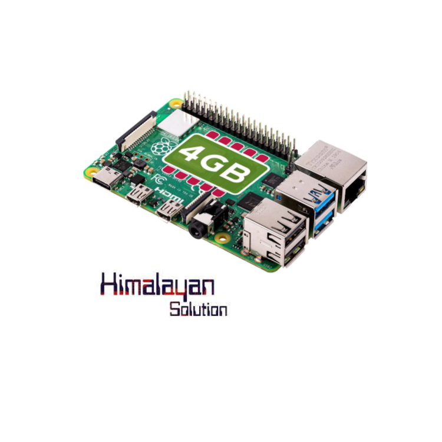
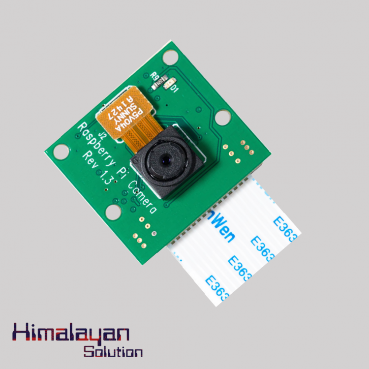
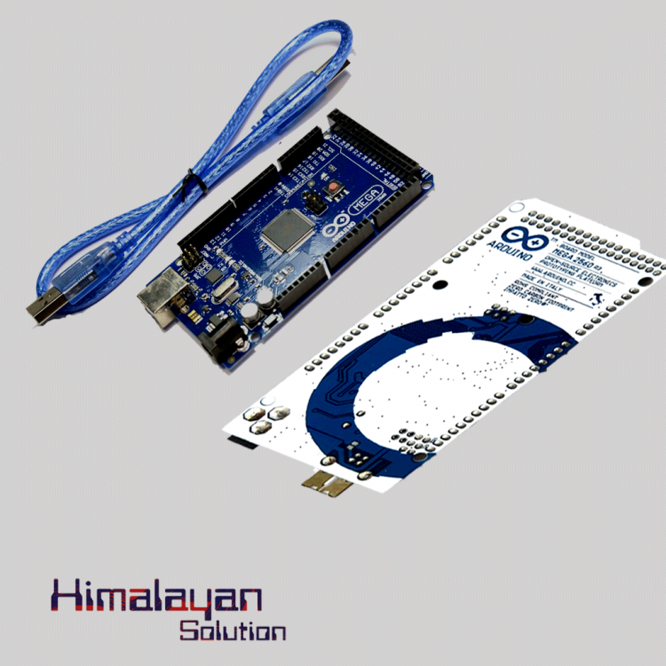

# AUTOMATIC-PLASTIC-BOTTLE-SORTING-WITH-ROBOTIC-ARM-USING-RASPBERRY-PI

# Final Year Project

## Hardware Used
- **Raspberry Pi Model 4B**
- - 
- **Pi Camera Module v1.3**
- - 
- **Arduino Mega**Photos/Arduino Mega.png
- - 
- **MG996r Servo Motor**
- - 
- **3D Printed Parts** (using PLA Filament)

---

## Purchase Links for Hardware
### Raspberry Pi Model 4B
- [Daraz Link](https://www.daraz.com.np/products/raspberry-pi-4-model-b4gb-i104200195-s1025080284.html?)
- [Himalayan Solution Link](https://himalayansolution.com/product/raspberry-pi-4-model-b-4-gb-ram)

### Pi Camera Module v1.3
- [Daraz Link](https://www.daraz.com.np/products/raspberry-pi-camera-v1-i125433870-s1034038299.html?)
- [Himalayan Solution Link](https://himalayansolution.com/product/raspberry-pi-camera-module-with-cable-5mp)

### Arduino Mega
- [Daraz Link](https://www.daraz.com.np/products/arduino-mega-with-usb-cable-i111519-s716963.html?)
- [Himalayan Solution Link](https://himalayansolution.com/product/arduino-mega-2560)

### MG996r Servo Motor
- [Daraz Link](https://www.daraz.com.np/products/mg-996r-metal-gear-servo-motor-i124620064-s1033846480.html?)
- [Himalayan Solution Link](https://himalayansolution.com/product/mg996r-servo-motor)
